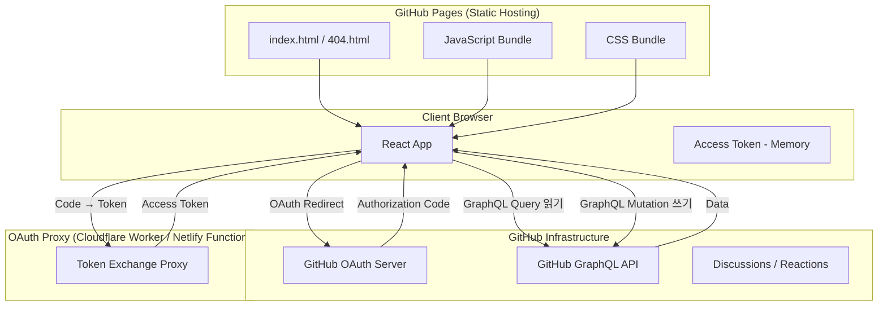
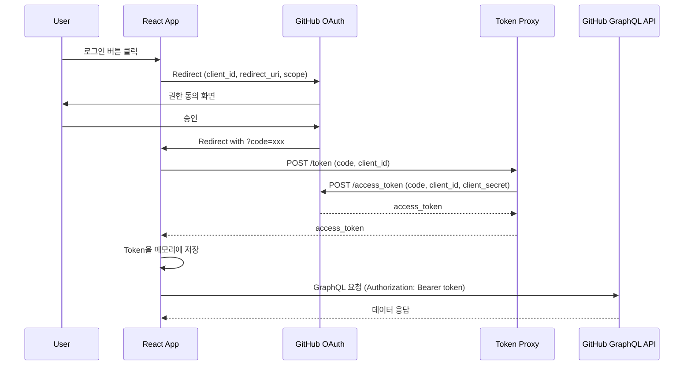
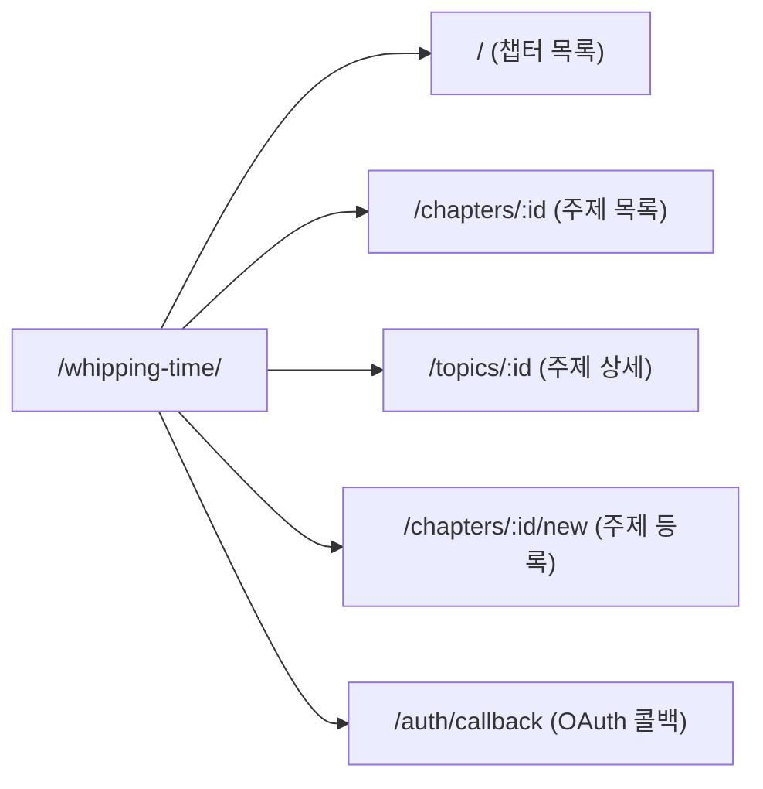
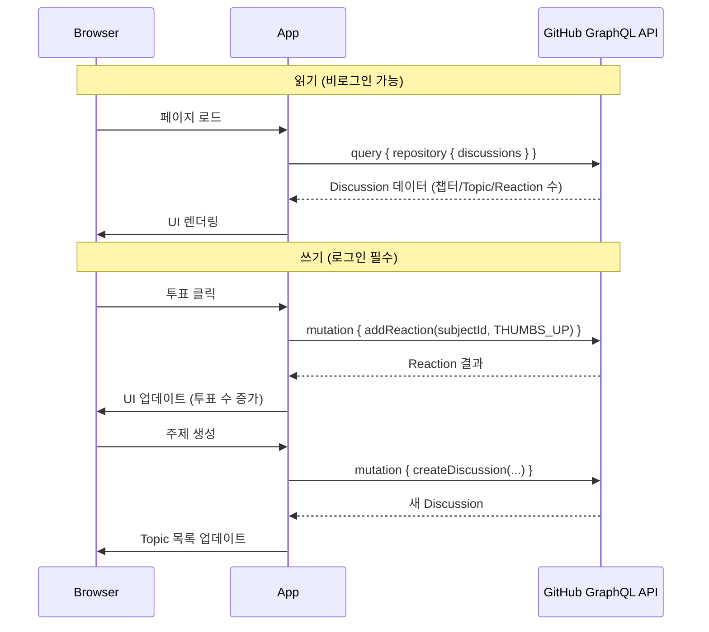
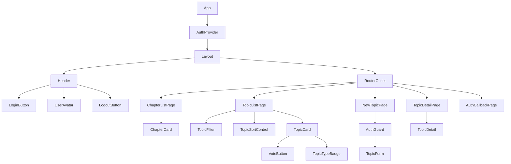

# Technical Design Document

## Overview

Whipping Time은 프론트엔드 챕터의 주제 선정 도구로, React 기반 SPA(Single Page Application)로 구현됩니다. GitHub Discussions API(GraphQL)를 통해 데이터를 관리하며, GitHub OAuth로 인증을 처리하고, GitHub Pages에 정적 배포됩니다. 읽기(조회)는 비로그인 상태에서 가능하며, 쓰기(주제 생성, 투표)는 GitHub OAuth 로그인이 필수입니다.

### 핵심 기술 스택

- **프레임워크**: React 18+ (TypeScript)
- **빌드 도구**: Vite (빠른 HMR, 최적화된 정적 빌드)
- **라우팅**: React Router v6 (클라이언트 사이드 라우팅)
- **상태 관리**: React Context + useReducer
- **스타일링**: CSS Modules 또는 Styled Components (디자인 토큰 관리)
- **API 통신**: GitHub GraphQL API (Discussions, Reactions)
- **인증**: GitHub OAuth (Authorization Code Flow + 프록시 서버)
- **배포**: GitHub Pages (base path: `/whipping-time/`)

### 설계 원칙

1. **GitHub 인프라 활용**: 별도 DB 없이 GitHub Discussions를 데이터 저장소로 활용
2. **읽기/쓰기 분리**: 비로그인 → 읽기 허용, 로그인 → 쓰기 가능
3. **접근성 우선**: WCAG 2.1 AA 준수, 키보드 내비게이션, 스크린 리더 지원
4. **반응형 디자인**: 모바일(360px+) ~ 데스크톱(768px+) 대응

## Architecture

### 시스템 아키텍처



### OAuth 인증 플로우



> **설계 결정**: GitHub OAuth는 SPA에서 직접 client_secret을 사용할 수 없으므로, 경량 프록시(Cloudflare Worker 또는 Netlify Function)를 통해 Authorization Code → Access Token 교환을 처리합니다. Token은 메모리에만 저장하며 새로고침 시 재인증이 필요합니다.

### 라우팅 구조



### 데이터 흐름



### GitHub Discussions 매핑 전략

| 도메인 개념 | GitHub Discussions 매핑 |
|------------|----------------------|
| Chapter | Discussion Category (또는 Label) |
| Topic | Discussion |
| Topic_Type | Label (`고민상담`, `떠먹여 드림`, `떠먹여 주세요`) |
| Vote | Discussion에 대한 👍 (THUMBS_UP) Reaction |
| Author | Discussion 작성자 (GitHub User) |
| 익명 여부 | Discussion body 내 메타데이터 (JSON frontmatter) |
| Assignee | Discussion body 내 메타데이터 |

## Components and Interfaces

### 컴포넌트 트리



### 핵심 컴포넌트 인터페이스

```typescript
// Auth Components
interface LoginButtonProps {
  returnPath?: string; // 로그인 후 리다이렉트할 경로
}

interface UserAvatarProps {
  user: GitHubUser;
}

interface AuthGuardProps {
  children: React.ReactNode;
  fallback?: React.ReactNode; // 비로그인 시 표시할 UI
}

// Pages
interface ChapterListPageProps {}
interface TopicListPageProps {}    // uses useParams for chapterId
interface TopicDetailPageProps {}  // uses useParams for topicId
interface NewTopicPageProps {}     // uses useParams for chapterId
interface AuthCallbackPageProps {} // OAuth 콜백 처리

// Components
interface ChapterCardProps {
  chapter: Chapter;
  isActive: boolean;
}

interface TopicCardProps {
  topic: Topic;
  hasVoted: boolean;
  isAuthenticated: boolean;
  onVote: (topicId: string) => void;
}

interface VoteButtonProps {
  count: number;
  hasVoted: boolean;
  isAuthenticated: boolean;
  isLoading: boolean;
  onClick: () => void;
  topicTitle: string; // 접근성 레이블용
}

interface TopicTypeBadgeProps {
  type: TopicType;
}

interface TopicFormProps {
  chapterId: string;
  onSubmit: (data: TopicFormData) => Promise<void>;
}

interface TopicFilterProps {
  selectedType: TopicType | 'all';
  onChange: (type: TopicType | 'all') => void;
}

interface TopicSortControlProps {
  sortBy: 'latest' | 'votes';
  onChange: (sort: 'latest' | 'votes') => void;
}
```

### Custom Hooks

```typescript
// 인증 관리
function useAuth(): {
  user: GitHubUser | null;
  token: string | null;
  isAuthenticated: boolean;
  isLoading: boolean;
  login: (returnPath?: string) => void;
  logout: () => void;
  error: Error | null;
};

// GitHub GraphQL API 클라이언트
function useGraphQL(): {
  query: <T>(query: string, variables?: Record<string, unknown>) => Promise<T>;
  mutate: <T>(mutation: string, variables?: Record<string, unknown>) => Promise<T>;
};

// 데이터 로딩
function useChapters(): {
  chapters: Chapter[];
  activeChapter: Chapter | null;
  isLoading: boolean;
  error: Error | null;
  retry: () => void;
  createChapter: (title: string) => Promise<void>;
};

function useTopics(chapterId: string): {
  topics: Topic[];
  isLoading: boolean;
  error: Error | null;
  retry: () => void;
  createTopic: (data: TopicFormData) => Promise<void>;
};

// 투표 관리
function useVote(discussionId: string): {
  hasVoted: boolean;
  voteCount: number;
  isLoading: boolean;
  toggleVote: () => Promise<void>;
};

// 필터링 및 정렬
function useTopicFilter(topics: Topic[]): {
  filteredTopics: Topic[];
  filter: TopicType | 'all';
  setFilter: (type: TopicType | 'all') => void;
};

function useTopicSort(topics: Topic[]): {
  sortedTopics: Topic[];
  sortBy: 'latest' | 'votes';
  setSortBy: (sort: 'latest' | 'votes') => void;
};
```

### Context 구조

```typescript
interface AuthContextValue {
  user: GitHubUser | null;
  token: string | null;
  isAuthenticated: boolean;
  isLoading: boolean;
  login: (returnPath?: string) => void;
  logout: () => void;
  error: Error | null;
}

interface AppContextValue {
  chapters: Chapter[];
  activeChapter: Chapter | null;
  isLoading: boolean;
  error: Error | null;
  retry: () => void;
}
```

### GitHub GraphQL 쿼리/뮤테이션

```typescript
// 챕터(카테고리) 및 Topic(Discussion) 조회
const GET_DISCUSSIONS = `
  query GetDiscussions($owner: String!, $repo: String!, $categoryId: ID!) {
    repository(owner: $owner, name: $repo) {
      discussions(categoryId: $categoryId, first: 50, orderBy: {field: CREATED_AT, direction: DESC}) {
        nodes {
          id
          title
          body
          createdAt
          author { login avatarUrl }
          labels(first: 5) { nodes { name } }
          reactions(content: THUMBS_UP) { totalCount }
          viewerHasReacted: reactions(content: THUMBS_UP) { viewerHasReacted }
        }
      }
    }
  }
`;

// Discussion 생성 (Topic 생성)
const CREATE_DISCUSSION = `
  mutation CreateDiscussion($repositoryId: ID!, $categoryId: ID!, $title: String!, $body: String!) {
    createDiscussion(input: {repositoryId: $repositoryId, categoryId: $categoryId, title: $title, body: $body}) {
      discussion { id title createdAt }
    }
  }
`;

// 투표 추가 (Reaction 추가)
const ADD_REACTION = `
  mutation AddReaction($subjectId: ID!) {
    addReaction(input: {subjectId: $subjectId, content: THUMBS_UP}) {
      reaction { id }
      subject { ... on Discussion { reactions(content: THUMBS_UP) { totalCount } } }
    }
  }
`;

// 투표 취소 (Reaction 제거)
const REMOVE_REACTION = `
  mutation RemoveReaction($subjectId: ID!) {
    removeReaction(input: {subjectId: $subjectId, content: THUMBS_UP}) {
      subject { ... on Discussion { reactions(content: THUMBS_UP) { totalCount } } }
    }
  }
`;
```

## Data Models

### GitHubUser 모델

```typescript
interface GitHubUser {
  login: string;       // GitHub 사용자명
  avatarUrl: string;   // 프로필 이미지 URL
  id: string;          // GitHub node ID
}
```

### Chapter 모델

```typescript
interface Chapter {
  id: string;              // Discussion Category ID (GitHub node ID)
  number: number;          // 챕터 회차 번호 (카테고리명에서 파싱)
  title: string;           // 챕터 제목 (1~50자)
  createdAt: string;       // ISO 8601 형식 생성일시
}
```

### Topic 모델

```typescript
type TopicType = '고민상담' | '떠먹여 드림' | '떠먹여 주세요';

interface Topic {
  id: string;              // Discussion node ID
  chapterId: string;       // 소속 챕터(Category) ID
  title: string;           // 주제 타이틀 (1~100자)
  type: TopicType;         // 주제 유형 (Label로 관리)
  description?: string;    // 설명 (최대 500자, 선택)
  reason?: string;         // 이유 (선택)
  author: AuthorInfo;      // 작성자 정보
  assignee?: string;       // 지목 대상 ("떠먹여 주세요" 전용)
  voteCount: number;       // 👍 Reaction 수 (0 이상)
  hasVoted: boolean;       // 현재 사용자의 투표 여부
  createdAt: string;       // ISO 8601 형식 생성일시
}

interface AuthorInfo {
  displayName: string;     // 화면 표시 이름 ("익명" 또는 GitHub login)
  isAnonymous: boolean;    // 익명 여부
}
```

### TopicFormData (제출용)

```typescript
interface TopicFormData {
  title: string;
  type: TopicType;
  description?: string;
  reason?: string;
  isAnonymous: boolean;      // "익명으로 표시" 체크박스 상태
  assignee?: string;         // type이 "떠먹여 주세요"일 때 필수
}
```

### Discussion Body 포맷 (메타데이터 저장)

Discussion의 body에 JSON frontmatter로 메타데이터를 저장합니다:

```markdown
<!-- metadata:{"type":"고민상담","isAnonymous":false,"assignee":"","reason":"관련 경험 공유"} -->

React Server Components를 실무에 적용한 경험을 공유합니다.
성능 개선 사례와 주의할 점을 다룹니다.
```

```typescript
interface DiscussionMetadata {
  type: TopicType;
  isAnonymous: boolean;
  assignee?: string;
  reason?: string;
}
```

### Domain ↔ Discussion 매핑 함수

```typescript
// Discussion → Topic 변환
function discussionToTopic(discussion: GitHubDiscussion, chapterId: string): Topic;

// TopicFormData → Discussion 생성 파라미터 변환
function topicFormToDiscussionInput(
  formData: TopicFormData,
  user: GitHubUser,
  categoryId: string
): CreateDiscussionInput;

// Discussion body에서 메타데이터 파싱
function parseDiscussionMetadata(body: string): DiscussionMetadata;

// 메타데이터를 Discussion body로 직렬화
function serializeDiscussionBody(metadata: DiscussionMetadata, description: string): string;
```

## Correctness Properties

*A property is a characteristic or behavior that should hold true across all valid executions of a system—essentially, a formal statement about what the system should do. Properties serve as the bridge between human-readable specifications and machine-verifiable correctness guarantees.*

### Property 1: 챕터 정렬 순서 보장

*For any* 챕터 배열에 대해, 챕터 정렬 함수를 적용하면 결과 배열의 모든 인접 원소 쌍(i, i+1)에서 chapters[i].number > chapters[i+1].number 관계가 성립해야 한다.

**Validates: Requirements 1.1**

### Property 2: 새 챕터 번호 자동 증가

*For any* 비어있지 않은 챕터 배열에 대해, 새로 생성되는 챕터의 번호는 기존 챕터들의 최대 번호 + 1이어야 한다. 빈 배열인 경우 새 챕터 번호는 1이어야 한다.

**Validates: Requirements 1.2**

### Property 3: 활성 챕터 결정

*For any* 비어있지 않은 챕터 배열에 대해, getActiveChapter 함수의 결과는 배열 내에서 가장 큰 number 값을 가진 챕터여야 한다.

**Validates: Requirements 1.4**

### Property 4: 챕터 제목 유효성 검증

*For any* 문자열에 대해, (a) 비어있거나 공백 문자로만 구성된 문자열은 검증에 실패해야 하고, (b) 50자를 초과하는 문자열은 검증에 실패해야 하며, (c) 1~50자의 비공백 문자를 포함한 문자열은 검증에 성공해야 한다.

**Validates: Requirements 1.5, 1.6**

### Property 5: Topic 생성 무결성

*For any* 유효한 TopicFormData와 활성 챕터에 대해, Topic 생성 함수는 (a) 제출된 title, type, description이 그대로 보존된 데이터를 생성하고, (b) 해당 Topic의 chapterId가 현재 활성 챕터 ID와 일치하며, (c) voteCount가 0으로 초기화되어야 한다.

**Validates: Requirements 2.1, 2.6**

### Property 6: Topic 폼 유효성 검증

*For any* TopicFormData에서 title이 비어있거나, type이 미선택이거나, type이 "떠먹여 주세요"인데 assignee가 비어있는 경우, 검증 함수는 항상 실패를 반환해야 한다. 반대로, 모든 필수 필드가 채워진 경우 검증은 성공해야 한다.

**Validates: Requirements 2.4, 2.7**

### Property 7: 작성자 표시 정규화

*For any* GitHub 사용자 정보와 익명 여부 플래그에 대해, (a) isAnonymous가 true이면 표시 이름은 항상 "익명"이어야 하고, (b) isAnonymous가 false이면 표시 이름은 해당 GitHub 사용자의 login이어야 한다.

**Validates: Requirements 3.2, 3.3**

### Property 8: 투표 토글 라운드트립

*For any* Topic과 초기 voteCount에 대해, 투표(addReaction)를 한 번 수행하면 count가 정확히 1 증가하고, 동일 Topic에 대해 투표 취소(removeReaction)를 수행하면 원래 count로 복원되어야 한다. 또한 어떤 상태에서도 voteCount는 0 이상이어야 한다.

**Validates: Requirements 5.2, 5.3, 5.6**

### Property 9: Topic 정렬 (투표 수 기준)

*For any* Topic 배열에 대해, 투표 수 기준 정렬 함수를 적용하면 (a) 모든 인접 원소 쌍에서 topics[i].voteCount >= topics[i+1].voteCount이고, (b) voteCount가 동일한 원소들 사이에서는 topics[i].createdAt <= topics[i+1].createdAt이어야 한다.

**Validates: Requirements 5.5**

### Property 10: Discussion ↔ Topic 매핑 라운드트립

*For any* 유효한 Topic 객체에 대해, Topic을 Discussion body 형식으로 직렬화(serializeDiscussionBody)한 후 다시 파싱(parseDiscussionMetadata)하면 원본의 type, isAnonymous, assignee, reason이 보존되어야 한다.

**Validates: Requirements 6.1, 6.3**

### Property 11: Topic 필터링 정확성

*For any* Topic 배열과 선택된 TopicType에 대해, 필터 함수를 적용하면 결과 배열의 모든 Topic은 해당 TopicType과 일치해야 하며, 원본 배열에서 해당 TopicType을 가진 모든 Topic이 결과에 포함되어야 한다(누락 없음).

**Validates: Requirements 8.3**

### Property 12: Topic 카드 필수 정보 포함

*For any* 유효한 Topic 객체에 대해, TopicCard 렌더링 결과에는 해당 Topic의 title, type, author.displayName, voteCount 정보가 모두 포함되어야 한다.

**Validates: Requirements 8.1**

### Property 13: 인증 가드 — 쓰기 동작 차단

*For any* 쓰기 동작(주제 생성, 투표)에 대해, 인증되지 않은 상태에서 해당 동작을 시도하면 동작이 수행되지 않고 로그인 안내가 반환되어야 한다.

**Validates: Requirements 10.3**

## Error Handling

### API 호출 실패

| 상황 | 처리 방식 |
|------|-----------|
| GraphQL 네트워크 에러 | 에러 메시지 표시 + 재시도 버튼 |
| GraphQL 응답 에러 (errors 필드) | 에러 메시지 파싱 후 사용자에게 표시 |
| API Rate Limit 초과 (403) | Rate Limit 안내 메시지 + 대기 후 재시도 |
| 3초 이상 로딩 지연 | 로딩 인디케이터 지속 표시 |
| Discussion 생성 실패 | 에러 메시지 표시 + 재시도 옵션, 폼 데이터 유지 |
| Reaction 추가/제거 실패 | 낙관적 업데이트 롤백 + 에러 토스트 |

### 인증 에러

| 상황 | 처리 방식 |
|------|-----------|
| OAuth 인증 코드 교환 실패 | 인증 실패 메시지 + 재시도 버튼 |
| OAuth redirect 파라미터 누락 | 에러 메시지 표시 + 홈으로 돌아가기 |
| Token 만료 (401 응답) | 자동 로그아웃 + 재로그인 안내 |
| OAuth scope 부족 | 필요 권한 안내 + 재인증 유도 |
| Proxy 서버 불가 | 인증 서비스 일시 불가 안내 |

### 입력 유효성 검증

| 상황 | 처리 방식 |
|------|-----------|
| 챕터 제목 빈값/초과 | 인라인 에러 메시지 + 제출 차단 |
| Topic 필수 필드 누락 | 해당 필드 하이라이트 + 에러 메시지 |
| Topic 타이틀 100자 초과 | maxLength 속성으로 입력 자체 제한 |
| 설명 500자 초과 | maxLength 속성으로 입력 자체 제한 |
| Assignee 미입력 ("떠먹여 주세요") | 인라인 에러 + 제출 차단 |

### 라우팅 에러

| 상황 | 처리 방식 |
|------|-----------|
| 존재하지 않는 챕터/Topic ID 접근 | "찾을 수 없음" 메시지 + 홈으로 돌아가기 링크 |
| 잘못된 URL 형식 | 404 페이지 표시 + 홈으로 돌아가기 링크 |
| OAuth 콜백 오류 상태 | 에러 표시 + 홈으로 돌아가기 |

### 낙관적 업데이트 전략

투표(Reaction) 동작은 낙관적 업데이트(optimistic update)를 적용합니다:
1. 사용자가 투표 버튼 클릭 → 즉시 UI 업데이트 (count 변경, 버튼 상태 변경)
2. 백그라운드에서 API 호출
3. API 실패 시 → UI 롤백 + 에러 토스트 표시

## Testing Strategy

### 테스트 프레임워크

- **단위/통합 테스트**: Vitest (Vite 생태계와의 자연스러운 통합)
- **Property-Based Testing**: fast-check (JavaScript/TypeScript PBT 라이브러리)
- **컴포넌트 테스트**: React Testing Library
- **접근성 테스트**: axe-core (자동 접근성 감사)
- **API 모킹**: MSW (Mock Service Worker) — GraphQL 요청 인터셉트
- **E2E 테스트**: Playwright (선택적, 주요 플로우 검증)

### API 모킹 전략 (MSW)

GitHub GraphQL API 호출을 MSW로 모킹하여 테스트 안정성과 속도를 확보합니다:

```typescript
// MSW 핸들러 예시
const handlers = [
  graphql.query('GetDiscussions', (req, res, ctx) => {
    return res(ctx.data({ repository: { discussions: mockDiscussions } }));
  }),
  graphql.mutation('AddReaction', (req, res, ctx) => {
    return res(ctx.data({ addReaction: { reaction: { id: 'new-reaction' } } }));
  }),
  graphql.mutation('CreateDiscussion', (req, res, ctx) => {
    return res(ctx.data({ createDiscussion: { discussion: mockNewDiscussion } }));
  }),
];
```

### Property-Based Tests (fast-check)

각 Correctness Property에 대해 fast-check를 사용하여 최소 100회 반복 실행:

| Property | 테스트 대상 함수 | Generator |
|----------|-----------------|-----------|
| 1: 챕터 정렬 | `sortChaptersByNumber` | `fc.array(fc.record({number: fc.nat()}))` |
| 2: 번호 자동 증가 | `getNextChapterNumber` | `fc.array(fc.record({number: fc.nat()}))` |
| 3: 활성 챕터 | `getActiveChapter` | `fc.array(fc.record({number: fc.nat()}), {minLength: 1})` |
| 4: 제목 유효성 | `validateChapterTitle` | `fc.string()`, `fc.stringOf(fc.constant(' '))` |
| 5: Topic 생성 | `topicFormToDiscussionInput` | Custom `TopicFormData` arbitrary |
| 6: 폼 유효성 | `validateTopicForm` | Custom invalid `TopicFormData` arbitrary |
| 7: 작성자 표시 | `getDisplayAuthor` | `fc.record({login: fc.string()})`, `fc.boolean()` |
| 8: 투표 토글 | `toggleVote` (with mocked API) | `fc.record({id: fc.uuid(), voteCount: fc.nat()})` |
| 9: Topic 정렬 | `sortTopicsByVotes` | `fc.array(topicArbitrary)` |
| 10: 매핑 라운드트립 | `serialize → parse` | Custom `DiscussionMetadata` arbitrary |
| 11: Topic 필터링 | `filterTopicsByType` | `fc.array(topicArbitrary)`, `fc.constantFrom(...)` |
| 12: Topic 카드 정보 | `TopicCard` render | Custom `Topic` arbitrary |
| 13: 인증 가드 | `AuthGuard` behavior | `fc.constantFrom('createTopic', 'vote')` |

각 테스트에는 다음 태그를 주석으로 포함:
```typescript
// Feature: whipping-time, Property {N}: {property_text}
```

### Unit Tests (Vitest + React Testing Library)

- **예제 기반 테스트**: OAuth 콜백 처리, 폼 초기화, 빈 상태 표시
- **엣지 케이스**: 빈 배열, API 에러 응답, 토큰 만료
- **컴포넌트 렌더링**: 조건부 필드 표시/숨김, 비활성 상태, 로그인/비로그인 UI 차이
- **에러 상태**: API 실패, 인증 실패, 네트워크 에러

### Integration Tests

- GitHub OAuth 플로우 (모킹된 프록시)
- GraphQL 쿼리/뮤테이션 응답 처리
- GitHub Pages 라우팅 (404.html 폴백)
- 반응형 레이아웃 (뷰포트별)
- 키보드 내비게이션 플로우
- 낙관적 업데이트 + 롤백

### 접근성 테스트

- axe-core를 Vitest에 통합하여 각 페이지/컴포넌트의 WCAG 2.1 AA 위반 자동 감지
- 키보드 포커스 순서 확인
- aria-label, role 속성 검증
- 로그인/비로그인 상태별 접근성 확인
